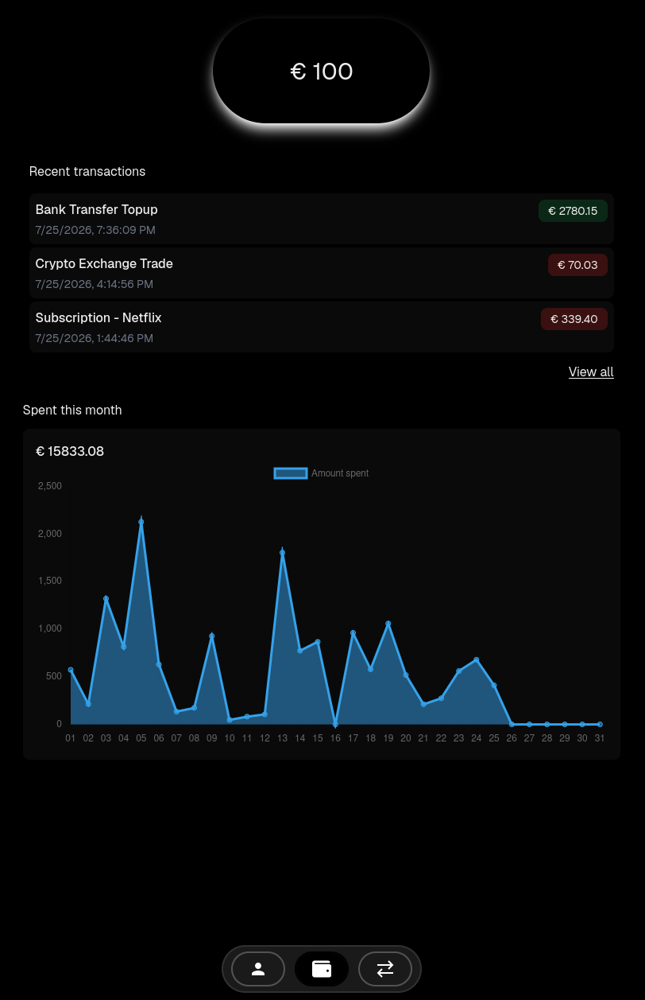
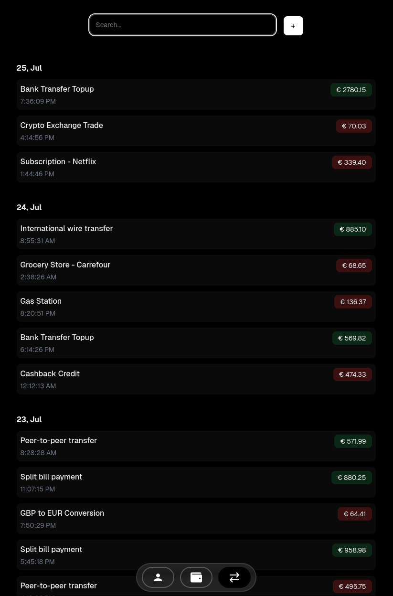

# Wallet

Funds and transactions web app in [NEXT.js](https://nextjs.org)

> [!IMPORTANT]
> Since this app is still in development, it may not work correctly or some
> functionalities might be missing

<div style="display: flex; gap: 10px;">


</div>

## Dependencies

- [npm](https://docs.npmjs.com)
- [wallet-api](https://github.com/AndreaGiorgino/wallet-api)

## Run

```bash
git clone git@github.com:AndreaGiorgino/wallet
cd wallet

npm install
npm run dev
```